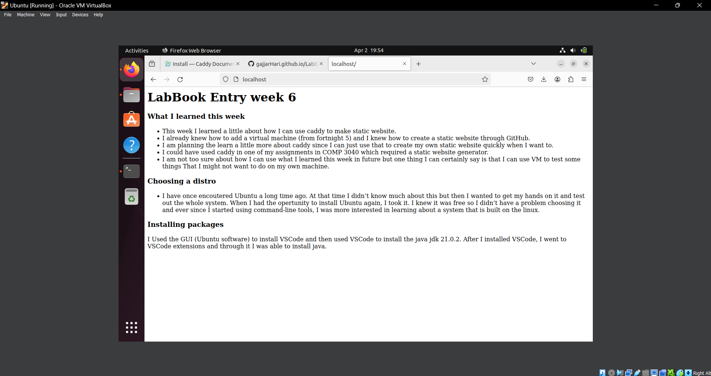

# LabBook Entry week 6
### What I learned this week
* This week I learned a little about how I can use caddy to make static website.
* I already knew how to add a virtual machine (from fortnight 5) and I knew how to create a static website through GitHub.
* I am planning the learn a little more about caddy since I can just use that to create my own static website quickly when I want to.
* I could have used caddy in one of my assignments in COMP 3040 which required a static website generator.
* I am not too sure about how I can use what I learned this week in future but one thing I can certainly say is that I can use VM to test some things That I might not want to do on my own machine.

### Choosing a distro
* I have once encoutered Ubuntu a long time ago. At that time I didn't know much about this but then I wanted to get my hands on it and test out the whole system. When I had the opertunity to install Ubuntu again, I took it. I knew it was free so I didn't have a problem choosing it and ever since I started using command-line tools, I was more interested in learning about a system that is built on the linux.

### Installing packages
I Used the GUI (Ubuntu software) to install VSCode and then used VSCode to install the java jdk 21.0.2.
After I installed VSCode, I went to VSCode extensions and through it I was able to install java.

### Running a web server
