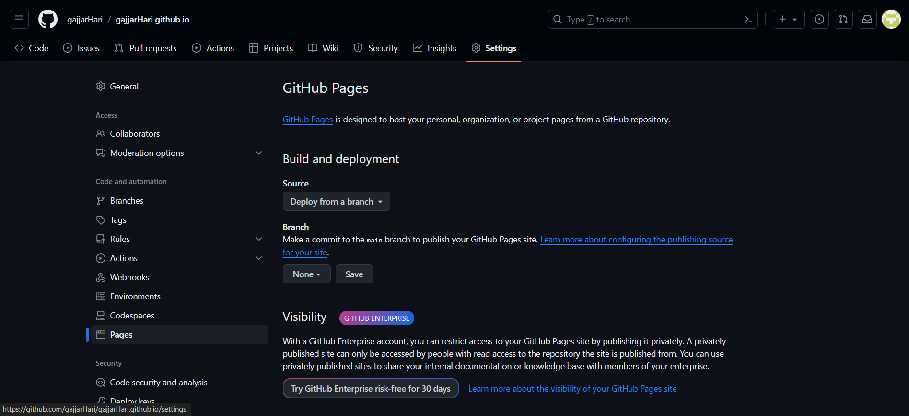
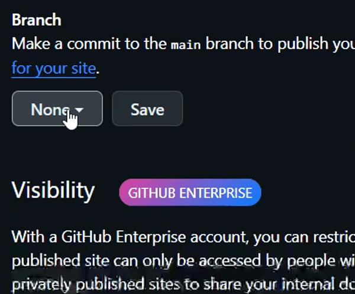
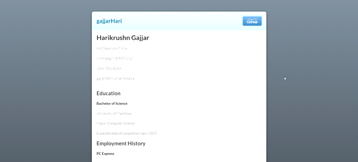

# Creating a static Website
### Purpose:
1. Describe how to create a static website using Markdown and Github.
2. Explain why the steps shows are important in creating a website.
### Prerequisites:
You must be able to create a text file using Markdown. If you do not know how to create a markdown file, then go to [more resources](#More-resources) section. A link is provided to learn how to create a Markdown file.
### Instuctions:

#### 1. Use Lightweight Markup language to create a text file of your linking
Create a text file which you want to show on the website. Use Markdown to create this file.

Lightweight Markup is important as it is the key to creating a static website. The reason being static website generator will create a website for you but it does not know what to show on there. Website generators will create the website and show what you write on your text file that you supplied it with.

Etter talks in his book about the importance of using lightweight markup. He shows how complex it can be to write same sentences with code that can be easily writen using a lightweight markup language.

What makes it greate is that it is: 

* easy to learn
* human readable and
* requires no coding

Markdown is a lightweight markup language. Markdown is extremly popular and widely used by static website generators. It is also quite easy to use as well. Since it is a lightweight markup language, creating a text file will be easy and fast.

#### 2. Use Github as your version control system

Create an account on Github. After that you will have to create a repository.

> Note:   When creating the repository, you must name it ```username.github.io```. Replace ```username``` with your username. This is important because with this, Github recongnizes that you want to create a static website.

You must upload the markdown file you created on this repository. Etter talks about what a version control system is in his book. He write how important a repository is to a programmer since it helps them keep track of their projects and files. Because of this, they do not have to worry about making changed to their code as they can retrieve the old data if something were to occur. Although he talks about how it is useful in writing code, it is also useful to us as well.

Once the file is uploaded and commited, we can make as many changes to the file we want. This is a static website so there is a possibility that you might want to change the content after some time. Even after these changes, if something goes wrong, we will not lose our data. We can recover it. This way you will not have to create the website from the beginning.

#### 3. Use Github to create a static website

 1. Once the file is uploaded, go to settings and then to pages as shown in this image.
    

 3. Navigate to Branch after that.
    

 5. Click on the box that says none, and from the options given, click on main. Then click on the save button to finish.
    

This will now start to create your website. It may take few minutes to several minutes. Once it is done, you can visit your website by searching ```username.github.io```.
> Note that you must change username with your username that you chose for your repository.


#### 4. Add a theme to your website
Create a file named ```_config.yml```. Make sure to have the underscore _ in front of the name as shown here. Then you can go to Github pages [supported themes](https://pages.github.com/themes/) to find yourself a theme. To add the theme I used follow the steps below.

 * Once the file is created, add ```theme: jekyll-theme-modernist``` in it and then save the file by commiting. Now your file has theme to it. Similar to my website theme below



Adding a theme is important. Imagine having a website with just text on it. Without themes, it looks plain and boring. Etter describes the importance of style. Having lists, pictures, and other style makes your writing more approachable. It becomes simpler to go through unlike having to go through just plain text file.


### More resources:
[Markdown](https://commonmark.org/help/tutorial/): For understanding more about markdown.

[Repositories](https://docs.github.com/en/repositories/creating-and-managing-repositories/quickstart-for-repositories): To learn and create repositories on Github.

[Github Pages](https://docs.github.com/en/pages/getting-started-with-github-pages/creating-a-github-pages-site): For more information on creating a website on Github.

[Github Pages themes](https://docs.github.com/en/pages/setting-up-a-github-pages-site-with-jekyll/adding-a-theme-to-your-github-pages-site-using-jekyll): This are the supported themes of Github Pages that you can use for your website.


### Authors and Acknowledgements:
This project is made possible by Github and Etter's book "Modern Technical writing: An Introduction to Software Documantation". Thanks to Github for providing the tools necessory to create this project. Thanks to Etter for writing his book that helped me understand the importance of each of the steps shown above.

### FAQs:
#### Why should I use Github in creating the website when there are other means?

There are many other ways to create a static website but not all of them are as easy as Github. Also unlike the others, Github is a version control system which allows you to keep track of the files. So, if there is a mistake in your file that Github uses to create the website, you can go back to the old version easily.

#### Why is my website not showing up?

There are many reasons as to why this is happening. Some of them are:
    
1. Your repository name is not username.github.io. The website can be created with different names like resume.github.io as long as github.io is in your repository name. If so, then only the website link changes. Which would now be username/repository_name.github.io.
2. You have not told Github that you want a website. To solve this problem follow the instuction step number 3 above which is ["Use Github to create a static website"](#3-use-github-to-create-a-static-website).
