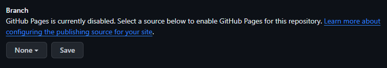

# Creating a static Website
### Purpose:
1. Describe how to create a static website using Markdown and github.
2. Explain why the steps shows are important in creating a website.
### Prerequisites:
You must be able to create a text file using Markdown.
### Instuctions:

#### 1. Use Lightweight Markup Language to create Markdown file
Create a Markdown file which you want to show on the website.

Lightweight Markup is important as it is the key to creating a static website. Website generators create the website by showing what is on that file. Markdown is a Lighweight Markup language. It is widely used by many static site generators and it is easy to use.

It is greate because it is: 

* easy to learn
* human readable and
* requires no coding

Etter talks in his book about the importance of using lightweight markup. He shows how complex it can be to write same sentences with code that can be easily writen using a lightweight markup language. Markdown files are easy to create and require no prior knowledge of any language.


Here is a website that can help you create a [markdown](https://commonmark.org/help/tutorial/) file.


#### 2. Use Github as your version control system

Create an account on Github. After that you will have to create a repository.

**Note:**   ```When creating the repository, you must name it username.github.io. Replace username with your username. This is important because with this, Github recongnizes that you want to create a static website.```

You must upload the markdown file you created on this repository. Etter talks about what a version control system is in his book. He write how important a repository is to a programmer since it helps them keep track of their projects and files. Because of this, they do not have to worry about making changed to their code as they can retrieve the old data if something were to occur. Although he talks about how it is useful in writing code, it is also useful to us as well.

Once the file is uploaded and commited, we can make as many changes to the file we want. This is a static website so there is a possibility that you might want to change the content after some time. Even after these changes, if something goes wrong, we will not lose our data. We can recover it. This way you will not have to create the website from the beginning.

#### 3. Use Github to create a static website

 1. Once the file is uploaded, go to settings and then to pages as shown in this image. 

 2. Navigate to Branch after that. 

 3. Click on the box that says none, and from the options given, click on main. The click on the save button to finish.
 


#### 4.
